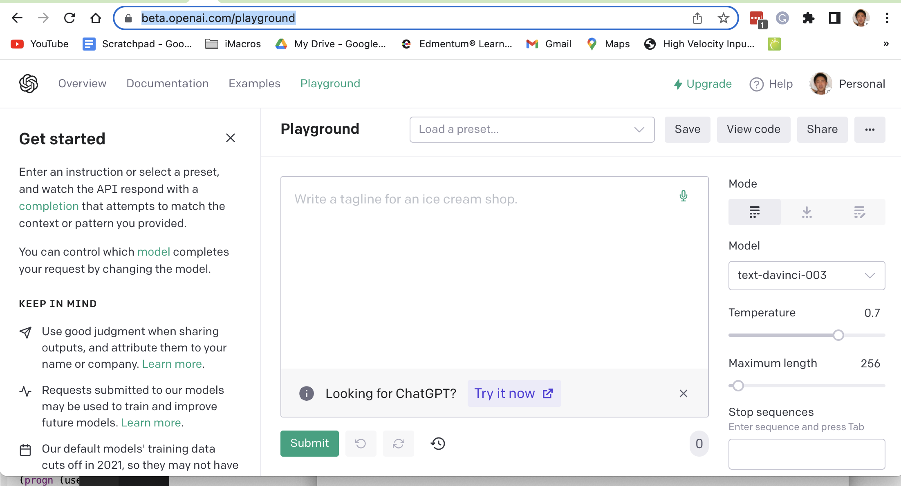
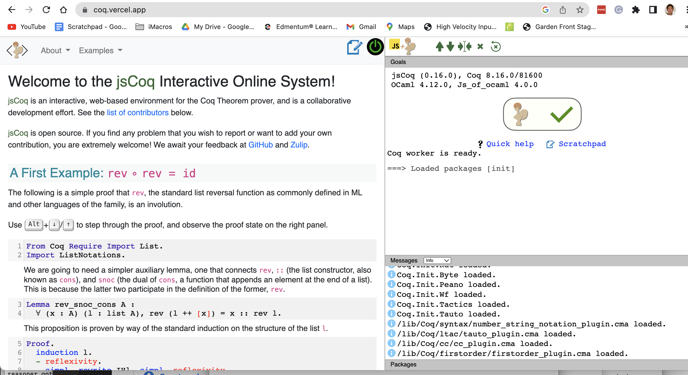
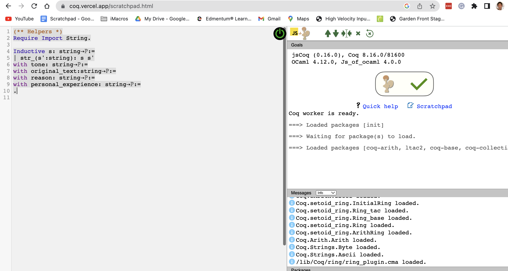
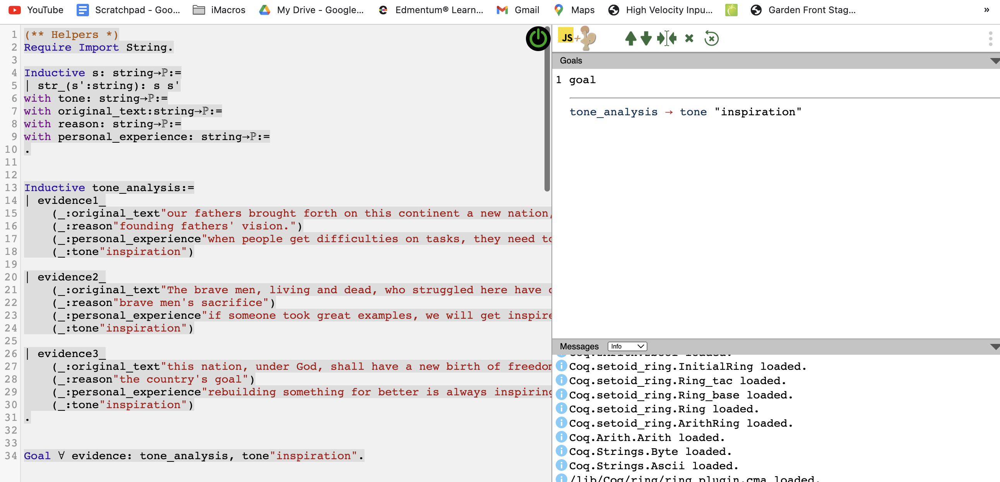

# Reasoner-Guided GPT3 Text Generation

This post is a step-by-step instruction to perform a reasoner-guided GPT3 completion.

The example is from a medium post https://medium.com/p/4528960b0141/edit

It is about leveraging Coq to write a logic reasoning structure, then use GPT3 to flesh out the reasoning process into a text. 

Now, this guide will help you navigate between the [Reasoner Coq website](https://coq.vercel.app/) and the [OpenAI GPT3 playground](https://beta.openai.com/playground) to complete a student's task of drafting a complex answer using both tools. 

<hr>
### Stage 1 - Environment Setup

* First, check you have access to the GPT3 playground [OpenAI GPT3 playground](https://beta.openai.com/playground). The screenshot for that page is 


<hr>

* Then, check you have access to [Reasoner Coq website](https://coq.vercel.app/). The screenshot for that is 

<hr>
### Stage 2 - Develop logic structure in the jsCoq scratchpad

* First, create a new scratchpad  [scratchpad link in jsCoq](https://coq.vercel.app/scratchpad.html), which can be launched on clicking the edit button middle top of the page. 


* Then, copy this below code to the left-hand side window


```

(** Helpers *)
Require Import String.

Inductive s: string->Prop:=
| str_(s':string): s s'
with tone: string->Prop:=
with original_text:string->Prop:=
with reason: string->Prop:=
with personal_experience: string->Prop:=
.


```

* Execute the DOWN button from the right-hand window
<hr>

* You should see this screenshot at this stage: 


<hr>
* Then copy the below code to that window


```

Inductive tone_analysis:=
| evidence1_
    (_:original_text"our fathers brought forth on this continent a new nation, conceived in liberty")
    (_:reason"founding fathers' vision.")
    (_:personal_experience"when people get difficulties on tasks, they need to pull back and think of the big picture, such as their value and commitment.")
    (_:tone"inspiration")

| evidence2_
    (_:original_text"The brave men, living and dead, who struggled here have consecrated it, far above our poor power to add or detract.")
    (_:reason"brave men's sacrifice")
    (_:personal_experience"if someone took great examples, we will get inspired by their deeds.")
    (_:tone"inspiration")

| evidence3_
    (_:original_text"this nation, under God, shall have a new birth of freedom, and that government of the people, by the people, for the people, shall not perish from the earth")
    (_:reason"the country's goal")
    (_:personal_experience"rebuilding something for better is always inspiring.")
    (_:tone"inspiration")
.


Goal forall evidence: tone_analysis, tone"inspiration".


```

The above blob defined an inductive data type `tone_analysis`, and a goal that states the fact that, for all evidence, the tone is "inspiration". 

<hr>
* Now you should see below status, after you execute the cursor to the bottom: 



<hr>

   * Notice that, in the right top quadrant, the proof state is shown, with no premises on top of the line and one conclusion beneath the line. 

* Copy beneath code to the left-hand side window

   ```
  intro. destruct evidence. (** Anchor 1 *)
  Focus 2. (** Anchor 2 *)
  Unfocus.
  Focus 3. (** Anchor 3 *)
  Unfocus.
  auto. auto. auto.
  Qed.
  ```

<hr>
* Navigate to `anchor 1`, note that the proof state changed to below: 


<hr>

* Now copy paste the proof state contents to GPT3 window


   * Please note that, I inserted the comment starting symbol "(**", which is highlighted. Please add this. 

   * Now append the following code snippet:

```
::
When I read about the sentence on "our fathers brought forth on 
this continent a new nation, conceived in liberty", I felt I was 
inspired because it laid out founding fathers' vision. In my 
personal experience, when people get difficulties on tasks, 
they need to pull back and think of the big picture, such as 
their value and commitment. *)
(**

```

* The above text becomes the auto-completion training data. Using one shot learning, GPT can learn how to take the proof state as input and produce the text after `::`. 


* Now come back to the jsCoq. Navigate the cursor to the "anchor 2". 
<hr>


* Copy the proof state out, and paste at the end of the Gpt3 window: 

* Append `::`, like this

```
(**
1 goal

o original_text
  "The brave men, living and dead, who struggled here have consecrated it, far above our poor power to add or detract." 
r reason "brave men's sacrifice" 
p personal_experience
  "if someone took great examples, we will get inspired by their deeds." 
t tone "inspiration" 
tone "inspiration"
::
When I read about the sentence on "our fathers brought forth on 
this continent a new nation, conceived in liberty", I felt I was 
inspired because it laid out founding fathers' vision. In my 
personal experience, when people get difficulties on tasks, 
they need to pull back and think of the big picture, such as 
their value and commitment. *)
(**
1 goal

o original_text
  "The brave men, living and dead, who struggled here have consecrated it, far above our poor power to add or detract." 
r reason "brave men's sacrifice" 
p personal_experience
  "if someone took great examples, we will get inspired by their deeds." 
t tone "inspiration" 
tone "inspiration"
::

```

* Press send. 
* What's next is very amazing. GPT3 learnt the first example and then apply the pattern in the auto generated text, like this:

<hr>


<hr>

* You can copy the generated text portion out and use it. 

* In the end, you will also repeat for the third evidence. 

* At the end, you get a large passage with your own reasoning as the backbone. 


